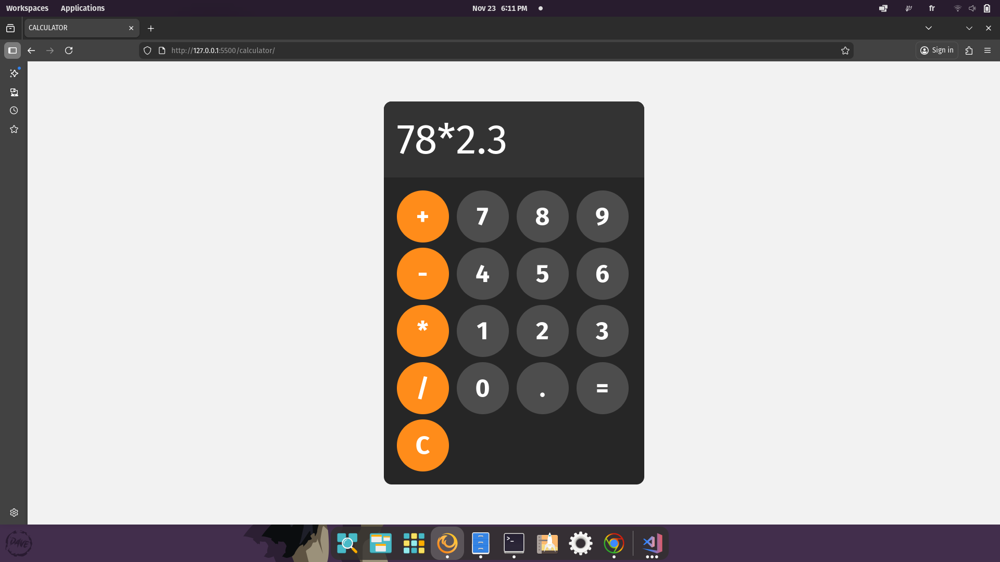

# Calculator

Welcome to **Calculator** — a simple web-based arithmetic calculator.

## 🚀 Project Overview
This project demonstrates working with inputs, display updates, and a basic expression evaluator. It is a great starter project for learning DOM interaction in JavaScript.

## 🌐 Live Demo
[View Demo](https://issamsensi.github.io/calculator/)

## 🌟 Features
- Basic arithmetic operations: +, -, *, /
- Clear and evaluate operations with the UI
- Simple and responsive keypad layout

## 🛠️ Technologies Used
- Frontend: HTML, CSS, JavaScript

## 📦 Project Structure
```
index.html      # Main demo page
main.js         # App logic (input handling, calculation)
style.css       # Styles
```

## 📸 Screenshots


## ✨ How to Use
1. Clone the repository (or copy this folder):
```zsh
git clone https://github.com/issamsensi/<repo>.git
cd <repo>/calculator
```
2. Open `index.html` in your browser.
3. Click numbers and operators then `=` to evaluate; use `C` to clear.

## 👤 Author
**ISSAM SENSI**

---
© 2025 [issamsensi](https://github.com/issamsensi)
